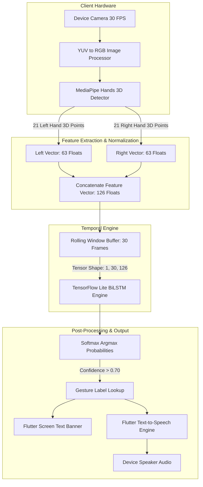
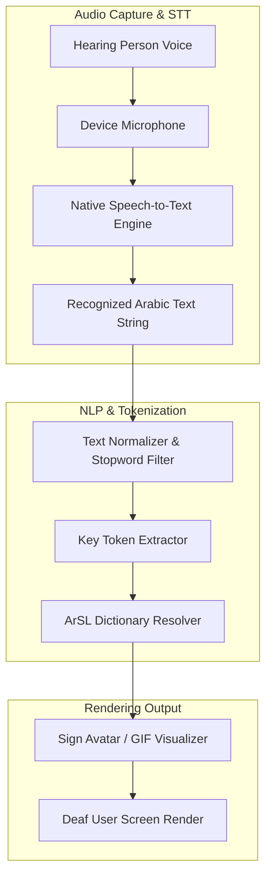

# SignTalk - Technical System Architecture & Specification

## 1. Architectural Blueprint & Philosophy

SignTalk is engineered with an **Edge-First, Zero-Cloud-Cost ($0 Budget)** architectural design. Rather than sending heavy raw video frames over high-latency network APIs (which incur high cloud server costs and network lag), SignTalk processes all computer vision feature extractions and neural network inferences **100% locally on the user's mobile device**.

---

## 2. End-to-End Data Flow Specification

### A. Sign Language to Speech Pipeline (Sign-to-Speech)

---

### B. Speech to Sign Language Pipeline (Speech-to-Sign)

---

## 3. Key Technical Specifications

### Feature Vector Formulation
For each camera frame $t$, MediaPipe extracts $K = 21$ keypoints for both hands:
$$\mathbf{v}_t = [x_{L,1}, y_{L,1}, z_{L,1}, \dots, x_{L,21}, y_{L,21}, z_{L,21}, x_{R,1}, y_{R,1}, z_{R,1}, \dots, x_{R,21}, y_{R,21}, z_{R,21}]^T \in \mathbb{R}^{126}$$

A sequence window of length $T = 30$ frames (1 second motion) forms input tensor:
$$\mathbf{X} \in \mathbb{R}^{1 \times 30 \times 126}$$

---

## 4. Latency Budget Analysis

| Pipeline Stage | Processing Unit | Latency |
|---|---|---|
| Frame Acquisition (30 FPS) | Camera Service | ~ 33 ms |
| Landmark Extraction | MediaPipe | ~ 10 ms |
| Sequence Accumulation | Circular Buffer | ~ 0 ms |
| TFLite Model Inference | Edge TFLite CPU/NNAPI | **8 - 12 ms** |
| TTS Audio Generation | Native OS Engine | ~ 5 ms |
| **Total System Delay** | **On-Device** | **< 20 ms** |
